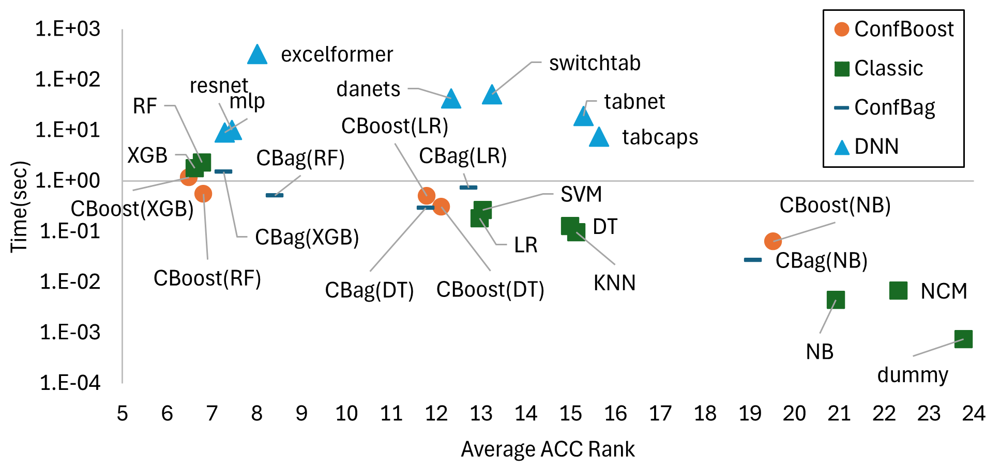
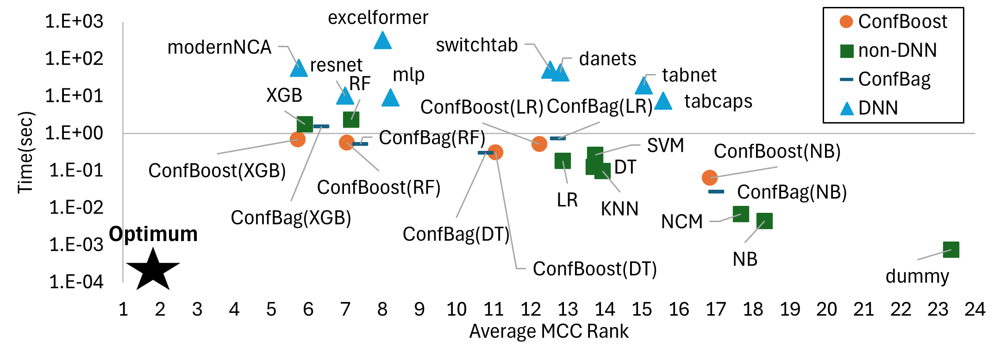
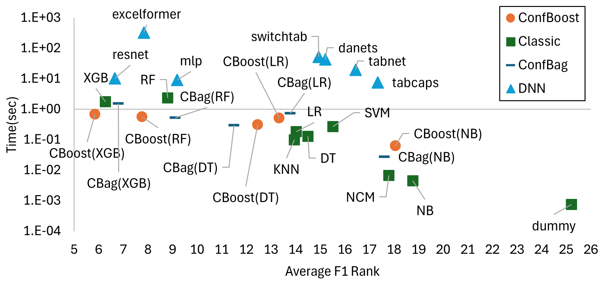

# Benchmarking Confidence Ensembles with LAMDA-TALENT

This folder contains the files and the results related to the banchmark of confidence ensembles with the framework LAMDA-TALENT.
The framework is available at https://github.com/qile2000/LAMDA-TALENT
If you are using this framework, please refer to the paper "TALENT: A Tabular Analytics and Learning Toolbox", which is available at https://arxiv.org/abs/2407.04057

## Benchmark Results 

Below we report the results of the benchmark of confidence ensembles against some algorthms in LAMDA-TALENT.
Results are averaged across datasets in LAMDA-TALENT that suit binary and multi-class classification (more than 100).
The plots follow a style similar to that of LAMDA-TALENT's paper, albeit not the same as there is no script available for plotting: thus we made our best to deliver results with similar pictures.

### Accuracy

### Matthews Coefficient

### Average F1

### Comment

Overall, the best classifiers should be on the left of pictures (low rank = good classifier) and on the bottom (the lower, the faster). Generally speaking, confidence ensembles, and especially ConfBoost, are lower and/or "leftier" than their base estimators alone.

## Benchmark Details

We cant share the full environment since the benchmarking library is not ours.
However, these are the steps we followed and files we used to execute the benchmark:
- clone the repository at https://github.com/qile2000/LAMDA-TALENT
- setup a Python 3.10 conda-venv containing all libraries needed by the code (see venv freeze at [conda_env_freeze](conda_env_freeze.txt))
- download datasets as per tutorial available at the GitHub above
- editing files (edited files are in the [ZIPfile](additional_files.zip), just uncompress it in the same folder as LAMDA-TALENT and overwrite) to allow running 
-- confidence boosting and confidence bagging ensembles, adding configuration files
-- classifiers from our study that are not in LAMDA-TALENT (e.g., Decision Tree) to maximise comparisons
-- computing additional metrics that were not in the original benchmark (e.g., MCC)
- creating scripts that exercise all classifiers on all classification datasets, saving results as CSV files (see [here](scripts_for_csv.zip))
- editing these CSV files as [Excel sheets](xls_summary.zip) for cleaning up data and plotting

